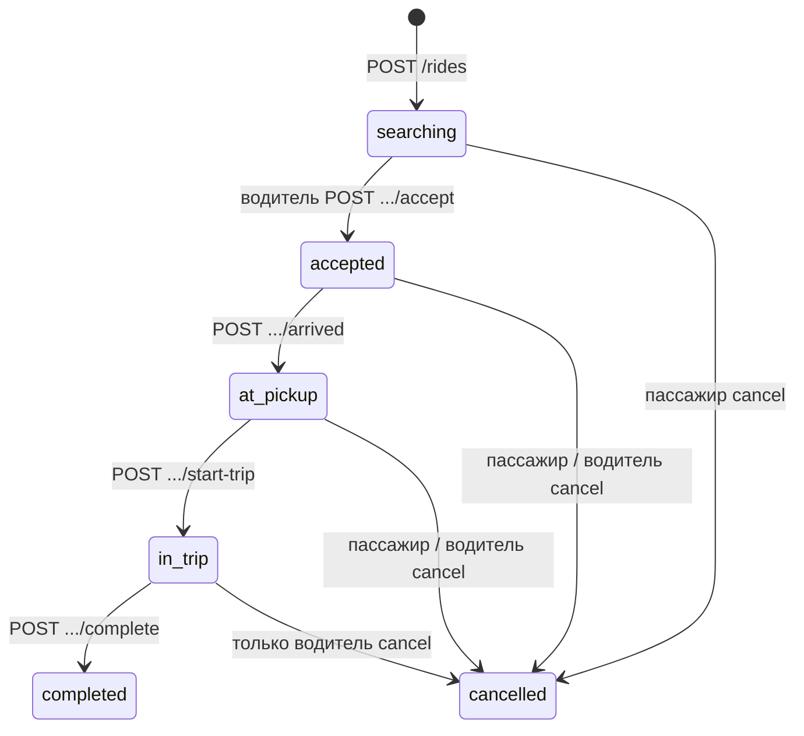

# DriveeUP

Монорепозиторий экосистемы **DriveeUP**: сервис заказа поездок (пассажир ↔ водитель), игровые механики, Battle Pass и веб-админка для части контента. В репозитории собраны:

| Компонент | Технологии |
|-----------|------------|
| **Backend** | PHP **8.4**, **Laravel 13**, MySQL, REST JSON API под префиксом `/api` |
| **Веб-клиент** | **React 19**, **Vite 8**, **React Router**, **Zustand**, SPA |
| **Android** | **Kotlin**, **Jetpack Compose**, MVVM, пакет `ru.driveeup.mobile` |
| **Инфраструктура** | **Docker Compose**: MySQL 8.4, nginx (TLS + reverse proxy), phpMyAdmin, Certbot |

Продакшен-ориентированная схема: внешний **nginx** терминирует HTTPS, проксирует `/api/` на контейнер **backend** (встроенный `php artisan serve` на порту **8000**), остальные запросы — на статический **frontend** (nginx внутри образа фронта).

---

## Содержание

1. [Структура репозитория](#структура-репозитория)  
2. [Архитектура в продакшене (Docker)](#архитектура-в-продакшене-docker)  
3. [Быстрый старт](#быстрый-старт)  
4. [Переменные окружения](#переменные-окружения)  
5. [Backend: разработка и Artisan](#backend-разработка-и-artisan)  
6. [HTTP API](#http-api)  
7. [Жизненный цикл заказа (поездки)](#жизненный-цикл-заказа-поездки)  
8. [База данных (обзор)](#база-данных-обзор)  
9. [Frontend](#frontend)  
10. [Android-приложение](#android-приложение)  
11. [Полезные команды и отладка](#полезные-команды-и-отладка)  
12. [Безопасность и ограничения](#безопасность-и-ограничения)  

---

## Структура репозитория

```
driveeup/
├── backend/                 # Laravel API
│   ├── app/Http/Controllers/Api/   # AuthController, RideController, BattlePass, игры
│   ├── database/migrations/
│   ├── routes/api.php
│   ├── Dockerfile           # composer install + php artisan serve :8000
│   └── .env.example
├── frontend/                # React SPA (сборка → статика в nginx-образе)
│   ├── src/
│   │   ├── App.jsx
│   │   ├── pages/           # BattlePass, админ BP, игры, Crossy
│   │   ├── crossy/          # игра, движок, API наград
│   │   └── authContext.jsx
│   └── Dockerfile
├── android-app/             # только исходники Kotlin (Gradle-проект подключается в IDE)
│   └── app/src/main/java/ru/driveeup/mobile/
│       ├── data/            # AuthRepository, RideRepository (HTTP)
│       ├── domain/          # модели User, RideOrder
│       ├── ui/              # Compose: AppScaffold, CityScreen, DriverCityScreen, …
│       └── MainActivity.kt
├── infra/nginx/
│   └── default-ssl.conf     # маршрутизация :443 → frontend / api
├── docker-compose.yml
├── .env.example             # учётные данные MySQL для Compose
└── README.md                # этот файл
```

Дополнительно в каталогах могут лежать локальные `README.md` (шаблоны Laravel/React) — **источник правды по проекту в целом** — корневой `README.md`.

---

## Архитектура в продакшене (Docker)

### Сервисы (`docker-compose.yml`)

| Сервис | Роль | Порты / особенности |
|--------|------|---------------------|
| **mysql** | БД MySQL 8.4 | Внутренняя сеть; том `mysql_data` |
| **backend** | Laravel, `php artisan serve` **0.0.0.0:8000** | Переменные `DB_*` из Compose; при старте: `migrate --force` |
| **frontend** | Статика после `npm run build` | Внутренний HTTP **80** |
| **nginx** | Reverse proxy | **80**, **443**; SSL из тома `certbot_conf` |
| **certbot** | Сертификаты Let’s Encrypt | Тома `certbot_www`, `certbot_conf` |
| **phpmyadmin** | Веб-UI MySQL | **8081→80** на хосте |

### Маршрутизация (см. `infra/nginx/default-ssl.conf`)

- **`/api/`** → `http://backend:8000` (полный `$request_uri` сохраняется).  
- **Остальное** → `http://frontend:80`; для SPA настроен fallback на `index.html` при 404.  
- Редирект с HTTP на HTTPS для указанного `server_name`.  
- Встроенный **resolver 127.0.0.11** — чтобы после пересборки контейнеров nginx подхватывал актуальные IP сервисов (избегание «502 Host is unreachable»).

Локально без домена и сертификатов конфиг из `infra/nginx` может потребовать правок (отдельный `server` только на `:80` или самоподписанный сертификат).

---

## Быстрый старт

### 1. Клонирование и окружение

```bash
git clone <url> driveeup
cd driveeup
cp .env.example .env
# при необходимости отредактируйте DB_NAME, DB_USER, DB_PASSWORD, DB_ROOT_PASSWORD
```

### 2. Запуск стека

```bash
docker compose up -d --build
```

Образ **backend** при сборке копирует код и подставляет `backend/.env` из `.env.example`, если `.env` не смонтирован; переменные **`DB_HOST`, `DB_DATABASE` и т.д.** для контейнера задаются секцией `environment` в `docker-compose.yml` и должны совпадать с сервисом **mysql**.

### 3. Миграции

В `Dockerfile` backend уже есть `php artisan migrate --force` в **CMD** перед `serve`. Если миграции нужно выполнить вручную:

```bash
docker compose exec backend php artisan migrate --force
```

### 4. Проверка здоровья Laravel

В `bootstrap/app.php` зарегистрирован маршрут **`GET /up`** (без префикса `/api`). Через прокси это будет **`https://<хост>/up`** — если nginx проксирует весь трафик на backend только для `/api`, то `/up` может отдаваться фронтом; уточняйте по фактическому nginx-конфигу. Прямой запрос к контейнеру backend:

```bash
docker compose exec backend wget -qO- http://127.0.0.1:8000/up
```

---

## Переменные окружения

### Корень репозитория (`.env` для Compose)

Файл **`.env.example`** задаёт:

- `DB_NAME` — имя БД (по умолчанию `driveeup`)  
- `DB_USER` / `DB_PASSWORD` — пользователь MySQL  
- `DB_ROOT_PASSWORD` — пароль root MySQL  

Используются подстановкой `${VAR:-default}` в `docker-compose.yml`.

### Backend (`backend/.env`)

Шаблон — **`backend/.env.example`** (стандартный Laravel: `APP_KEY`, `APP_URL`, драйвер БД и т.д.).  

В **Docker** для подключения к MySQL обычно задают:

- `DB_CONNECTION=mysql`  
- `DB_HOST=mysql` (имя сервиса в Compose)  
- `DB_PORT=3306`  
- `DB_DATABASE`, `DB_USERNAME`, `DB_PASSWORD` — согласованы с сервисом **mysql**  

В образе по умолчанию может копироваться `.env` с `DB_CONNECTION=sqlite` из шаблона — **переменные окружения контейнера** из Compose имеют приоритет при конфигурировании Laravel для типичного деплоя.

---

## Backend: разработка и Artisan

- **PHP**: ^8.3 в `composer.json`, образ Docker — **PHP 8.4** CLI Alpine.  
- **Точка входа API**: `routes/api.php` (префикс `/api` задаётся фреймворком).  
- **Аутентификация**: долгоживущий **`api_token`** в таблице `users`; клиент передаёт заголовок  
  `Authorization: Bearer <token>`  
  (см. `AuthController::resolveUserFromToken`, `RideController::resolveUser`).

Полезные команды внутри контейнера:

```bash
docker compose exec backend php artisan route:list
docker compose exec backend php artisan migrate
docker compose exec backend php artisan config:clear
```

Штатный скрипт из `composer.json` (`composer run setup`) рассчитан на локальную машину с Node/npm и не обязателен при чисто Docker-рабочем процессе.

---

## HTTP API

Базовый URL: **`https://<домен>/api`** (в разработке — как настроен хост; Android по умолчанию использует `https://driveeup.ru/api` — см. `AuthRepository` / `RideRepository`).

Общие правила:

- Тип контента для тел с JSON: `Content-Type: application/json`.  
- Ответы — JSON; при ошибках часто поле **`error`** (строка).  
- Защищённые методы требуют **`Authorization: Bearer ...`**.

### Авторизация и профиль

| Метод | Путь | Токен | Описание |
|-------|------|-------|----------|
| POST | `/auth/register` | Нет | Регистрация: `email`, `password`, `role` (`PASSENGER` \| `DRIVER`), опционально `firstName`, `lastName`. Ответ: `accessToken`, `user`. |
| POST | `/auth/login` | Нет | `email`, `password` → `accessToken`, `user`. |
| GET | `/auth/me` | Да | Текущий пользователь (объект как в `transformUser`). |
| PUT | `/auth/avatar` | Да | `avatarUrl` (строка, в т.ч. data URL). |
| PUT | `/auth/role` | Да | `role`: `PASSENGER` или `DRIVER` — смена роли. |

Формат пользователя в JSON (ключевые поля): `id`, `email`, `firstName`, `lastName`, `city`, `role`, `isAdmin`, `driveCoin`, `totalDriveCoin`, `premium`, `avatarUrl`, `ratingAvg`, `ridesCount`, `vehicleModel`, `vehiclePlate`.

### Поездки (`RideController`)

| Метод | Путь | Кто | Описание |
|-------|------|-----|----------|
| POST | `/rides` | Пассажир (или ADMIN) | Создать заказ: `fromLat`, `fromLon`, `fromAddress`, `toLat`, `toLon`, `toAddress`, `priceRub`. Статус `searching`. Нельзя иметь второй активный заказ в статусах `searching`, `accepted`, `at_pickup`, `in_trip`. |
| GET | `/rides/passenger/active` | Пассажир | Активная поездка или незавершённая оценка (`completed` без `driver_rating` для пассажира — см. код). |
| GET | `/rides/driver/active` | Водитель / ADMIN | Текущая поездка водителя: `accepted`, `at_pickup`, `in_trip`. |
| GET | `/rides/driver/feed` | Водитель / ADMIN | Лента заказов в статусе `searching`, исключая пропущенные этим водителем. |
| GET | `/rides/{id}` | Участник поездки или ADMIN | Детали заказа. |
| POST | `/rides/{id}/skip` | Водитель | Пропустить заказ (запись в `ride_order_skips`). |
| POST | `/rides/{id}/counter` | Водитель | Контрпредложение цены: `priceRub` → выставляется `agreed_price_rub` (пока заказ в `searching`). |
| POST | `/rides/{id}/accept` | Водитель | Принять: опционально `etaMinutes`, `agreedPriceRub`; транзакция, статус `accepted`, назначается водитель. |
| POST | `/rides/{id}/arrived` | Водитель | «На месте» → `at_pickup`. |
| POST | `/rides/{id}/start-trip` | Водитель | Начало поездки → `in_trip`, сбрасывает `passenger_exiting`. |
| POST | `/rides/{id}/complete` | Водитель | Завершение → `completed`. |
| POST | `/rides/{id}/passenger-exit` | Пассажир | Флаг «пассажир выходит» (`passengerExiting`), только для `accepted` или `at_pickup`. |
| POST | `/rides/{id}/cancel-passenger` | Пассажир | Отмена в ранних статусах → `cancelled`. |
| POST | `/rides/{id}/cancel-driver` | Водитель | Отмена водителем в `accepted` / `at_pickup` / `in_trip` → `cancelled`. |
| POST | `/rides/{id}/rate` | Участник | `stars` (1–5), `target`: `driver` или `passenger`; только для `completed`, одна оценка на цель. Обновляет агрегаты рейтинга у пользователя. |

Объект поездки в JSON включает: `id`, `passengerId`, `driverId`, координаты и адреса, `priceRub`, `agreedPriceRub`, **`displayPriceRub`** (договорная или исходная), `status`, `driverEtaMinutes`, `passengerExiting`, рейтинги, `createdAt`, вложенные `passenger` / `driver` (краткая карточка).

### Игры и Battle Pass

| Метод | Путь | Назначение |
|-------|------|------------|
| POST | `/game/claim-drivee-coin` и `/game/claim-drive-coin` | Начисление игровой валюты (алиас на один контроллер). |
| GET | `/battle-pass/current` | Текущий сезон / прогресс. |
| GET | `/battle-pass/level-icons/{path}` | Иконки уровней. |
| POST | `/battle-pass/levels/{level}/claim-gift` | Получение награды уровня. |
| Разное `/admin/battle-pass/*` | CRUD сезонов, уровней, загрузка иконок | Администрирование (проверка прав — в контроллере; см. код). |

Точное поведение и валидация — в `App\Http\Controllers\Api\*`.

---

## Жизненный цикл заказа (поездки)

Статусы в поле **`status`** модели `RideOrder`:



Дополнительно:

- В **`searching`** водитель может отправить **`counter`** (цена), затем **`accept`**.  
- **`passengerExit`**: флаг `passenger_exiting` для UX (пассажир вышел к подъезду); сбрасывается при переходе в **`in_trip`**.  
- После **`completed`** стороны вызывают **`rate`** для оценки контрагента.

---

## База данных (обзор)

Миграции в **`backend/database/migrations/`**, в том числе:

- **`users`** — базовые поля Laravel плюс: `api_token`, роль, монеты, аватар, имя/фамилия/город, рейтинг, счётчик поездок, авто водителя, флаги admin/premium и др.  
- **`ride_orders`** — поездки (координаты, адреса, цены, статус, ETA, флаги выхода пассажира, рейтинги).  
- **`ride_order_skips`** — пары водитель ↔ заказ для скрытия из ленты.  
- Таблицы **Battle Pass**, **Crossy** и пр. — по именам миграций с датами `2026_04_01_*`.

Связи и каскады описаны в соответствующих миграциях.

---

## Frontend

- **Сборка**: `npm ci` / `npm install`, `npm run build` — выход в `dist/`, образ **frontend** копирует в nginx.  
- **Разработка**: `npm run dev` — Vite dev server (порт см. в консоли).  
- **Структура** (`frontend/src/`): страницы Battle Pass (в т.ч. админка), игры, **Crossy** (canvas, физика, звуки), общий `authContext`, `App.jsx` с роутингом.

API-вызовы с браузера должны идти на тот же origin, что и фронт, с префиксом **`/api`**, либо на отдельный хост с CORS (если будет добавлен).

---

## Android-приложение

### Назначение

Один модуль приложения с переключением сценариев **пассажир / водитель** (роль с сервера и локальные экраны): городской заказ, профиль, игры, Battle Pass, Drive Up и др.

### Структура пакета (упрощённо)

| Пакет / файлы | Назначение |
|----------------|------------|
| `data/AuthRepository.kt`, `RideRepository.kt` | HTTP-клиент на `HttpURLConnection`, JSON через `org.json` |
| `domain/` | `User`, `RideOrder`, роли |
| `ui/auth/` | Экран входа и регистрации, `AuthViewModel` |
| `ui/AppScaffold.kt` | Тема, drawer, восстановление сессии из `SharedPreferences`, маршрутизация по роли |
| `ui/home/CityScreen.kt` | Пассажир: карта, заказ |
| `ui/home/DriverCityScreen.kt` | Водитель: лента, активная поездка, osmdroid + маршруты OSRM |
| `MainActivity.kt` | Точка входа Compose |

### Базовый URL API

В **`AuthRepository`** и **`RideRepository`** задано:

```kotlin
private val apiBase = "https://driveeup.ru/api"
```

Для отладки с эмулятором на локальном backend без HTTPS замените на, например, `http://10.0.2.2/api` (порт пробросьте на хост) или используйте `BuildConfig`/flavor — **в репозитории это значение захардкожено**, его нужно менять под окружение.

### Запуск в IDE

Откройте каталог **`android-app`** в **Android Studio** как проект. Если в репозитории не хватает файлов Gradle (`build.gradle.kts`, `settings.gradle.kts`), создайте новый проект Empty Compose с package `ru.driveeup.mobile` и перенесите исходники из `app/src/main/java/...`, как описано в `android-app/README.md`.

### Внешние сервисы на клиенте

Карты и маршруты: **osmdroid** для отображения, для построения полилиний используется публичный **OSRM** (см. `MapRouteHelpers.kt` и связанные экраны) — учитывайте лимиты и политику использования при продакшене.

---

## Полезные команды и отладка

| Задача | Команда |
|--------|---------|
| Пересобрать образы и поднять контейнеры | `docker compose up -d --build` |
| Логи backend | `docker compose logs -f backend` |
| Логи nginx | `docker compose logs -f nginx` |
| Shell в backend | `docker compose exec backend sh` |
| MySQL с хоста | Подключение к `localhost:3306` при пробросе порта (сейчас в compose не проброшен наружу — используйте **phpMyAdmin:8081** или `docker compose exec mysql mysql -u...`) |
| Остановка | `docker compose down` |

При **502** между nginx и backend проверьте, что контейнер **backend** слушает `8000` и резолвится имя `backend` (см. resolver в nginx).

---

## Безопасность и ограничения

- Токены **`api_token`** хранятся в открытом виде в БД; для продакшена рассмотрите ротацию, срок жизни и HTTPS-only.  
- Админ-эндпоинты Battle Pass должны быть защищены проверкой **`is_admin`** (реализуйте и проверяйте в коде контроллеров).  
- Загрузка аватара как длинная строка URL/data URL — ограничения по размеру на стороне сервера и клиента.  
- Репозиторий может не содержать полного Android Gradle-проекта — сборка APK на CI настраивается отдельно.

---

## Лицензия

Укажите лицензию проекта в корне репозитория при публикации. Фреймворки (Laravel, React и др.) имеют собственные лицензии.
